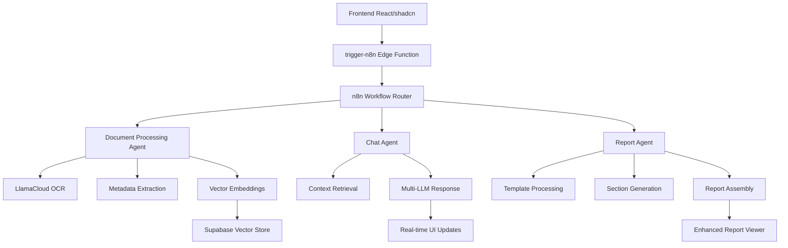

# 🤖 AI Agents Architecture

This document provides comprehensive documentation for the AI agents implemented in the Town Planner RAG system, focusing on n8n workflows, edge function integrations, and enhanced UI/UX interactions.

---

## 📋 Table of Contents

1. [Agent Overview](#agent-overview)
2. [Document Processing Agent](#document-processing-agent)
3. [Chat/Conversation Agent](#chatconversation-agent)
4. [Report Generation Agent](#report-generation-agent)
5. [Embedding & Vector Search Agent](#embedding--vector-search-agent)
6. [Integration Patterns](#integration-patterns)
7. [Error Handling & Monitoring](#error-handling--monitoring)
8. [Development & Testing](#development--testing)
9. [Performance Optimization](#performance-optimization)
10. [Configuration & Deployment](#configuration--deployment)

---

## 🎯 Agent Overview

The Town Planner RAG system employs a **hybrid architecture** combining n8n workflows and Supabase Edge Functions to create intelligent agents that handle different aspects of the document processing and interaction pipeline.

### Agent Types

| Agent Type | Primary Function | Technology | UI Integration |
|------------|------------------|------------|----------------|
| **Document Processing** | PDF/DOCX ingestion, OCR, chunking | n8n + LlamaCloud | Upload progress, toast notifications |
| **Chat/Conversation** | Real-time messaging, context retrieval | n8n + Multi-LLM | Enhanced chat UI, typing indicators |
| **Report Generation** | Structured report creation | Edge Functions + n8n | Report viewer, progress tracking |
| **Vector Search** | Semantic similarity search | Edge Functions | Source citations, reference popovers |
| **Embedding Generation** | Text-to-vector conversion | n8n + LLM Providers | Background processing indicators |

### Architecture Flow



---

## 📄 Document Processing Agent

### Primary Responsibilities

The Document Processing Agent handles the complete lifecycle of document ingestion with enhanced user feedback through the shadcn/ui interface.

#### **Webhook Configuration**
- **Endpoint**: `https://n8n.coralshades.ai/webhook/ingest`
- **Method**: POST
- **Authentication**: n8n API Key + JWT validation
- **Rate Limiting**: 10 requests/minute per user

#### **Input Schema**

```typescript
interface DocumentIngestRequest {
  fileUrl: string;          // Supabase Storage URL
  fileName: string;         // Original filename with extension
  mimeType: string;         // 'application/pdf' | 'application/vnd.openxmlformats-officedocument.wordprocessingml.document'
  userId: string;           // Supabase auth user ID
  projectId?: string;       // Optional notebook/project association
  options?: {
    extractMetadata?: boolean;    // Enable AI metadata discovery
    preserveTables?: boolean;     // Maintain table structure in chunks
    ocrQuality?: 'fast' | 'accurate';  // OCR processing mode
    chunkSize?: number;           // Semantic chunk size (default: 1000)
    chunkOverlap?: number;        // Overlap between chunks (default: 200)
  };
}
```

#### **Processing Workflow**

1. **File Validation & Download**
   ```javascript
   // n8n: Validate file format and size
   if (!['application/pdf', 'application/vnd.openxmlformats-officedocument.wordprocessingml.document'].includes(mimeType)) {
     throw new Error('Unsupported file format');
   }
   
   // Download from Supabase Storage
   const fileBuffer = await downloadFile(fileUrl);
   ```

2. **LlamaCloud OCR Processing**
   ```javascript
   // Enhanced OCR with table preservation
   const ocrResult = await llamaCloudParse({
     file: fileBuffer,
     parsing_instruction: "Extract all text while preserving table structure and formatting",
     result_type: "markdown",
     verbose: true
   });
   ```

3. **AI Metadata Discovery**
   ```javascript
   // Intelligent field extraction
   const metadataPrompt = `
   Analyze this planning document and extract structured metadata:
   - Document type (development application, environmental report, etc.)
   - Property address and legal description
   - Applicant and consultant information
   - Key dates and reference numbers
   - Planning zones and overlays
   `;
   
   const metadata = await llmAnalyze(ocrResult.markdown, metadataPrompt);
   ```

4. **Semantic Chunking**
   ```javascript
   // Advanced chunking with context preservation
   const chunks = await semanticChunker({
     text: ocrResult.markdown,
     chunkSize: options.chunkSize || 1000,
     overlap: options.chunkOverlap || 200,
     preserveStructure: options.preserveTables,
     headers: extractHeaders(ocrResult.markdown)
   });
   ```

5. **Vector Embedding Generation**
   ```javascript
   // Batch embedding generation
   const embeddings = await generateEmbeddings({
     texts: chunks.map(chunk => chunk.content),
     provider: 'ollama', // or 'openai', 'gemini'
     model: 'nomic-embed-text:latest'
   });
   ```

#### **Output Schema**

```typescript
interface DocumentIngestResponse {
  jobId: string;           // Processing job ID for tracking
  status: 'pending' | 'processing' | 'completed' | 'failed';
  message: string;         // Human-readable status message
  progress?: number;       // Processing progress (0-100)
  result?: {
    documentId: string;    // Generated document ID
    chunks: number;        // Number of chunks created
    metadata: Record<string, any>;  // Extracted metadata
    processingTime: number; // Total processing time in ms
  };
  error?: {
    code: string;          // Error code for debugging
    message: string;       // User-friendly error message
    details?: any;         // Technical error details
  };
}
```

#### **UI Integration Features**

- **Real-time Progress Updates**: WebSocket connection shows processing stages
- **Enhanced Upload Component**: Drag-and-drop with shadcn Progress indicators
- **Toast Notifications**: Success/error feedback using shadcn Sonner
- **Error Recovery**: Retry mechanisms with exponential backoff

---

## 💬 Chat/Conversation Agent

### Primary Responsibilities

Handles real-time chat interactions with enhanced UI feedback, context retrieval, and multi-LLM responses.

#### **Webhook Configuration**
- **Endpoint**: `https://n8n.coralshades.ai/webhook/hhlm-chat`
- **Method**: POST
- **Streaming**: Server-Sent Events for real-time responses
- **Context Window**: 8K tokens with intelligent truncation

#### **Input Schema**

```typescript
interface ChatRequest {
  sessionId: string;       // Chat session identifier
  message: string;         // User message content
  userId: string;          // Authenticated user ID
  context?: {
    documentIds?: string[];     // Specific documents to search
    reportId?: string;          // Active report context
    maxSources?: number;        // Maximum citation sources (default: 5)
    searchMode?: 'semantic' | 'keyword' | 'hybrid';
    llmProvider?: 'ollama' | 'openai' | 'gemini';
    temperature?: number;       // Response creativity (0-1)
  };
  metadata?: {
    location?: string;          // User location for context
    timestamp?: string;         // Message timestamp
    deviceType?: 'mobile' | 'desktop';
  };
}
```

#### **Processing Workflow**

1. **Message Preprocessing**
   ```javascript
   // Enhanced message analysis and routing
   const messageAnalysis = await analyzeMessage({
     content: message,
     previousContext: await getChatHistory(sessionId, 5),
     intent: await detectIntent(message) // question, request, command
   });
   ```

2. **Context Retrieval**
   ```javascript
   // Intelligent document search with ranking
   const searchResults = await vectorSearch({
     query: message,
     userId: userId,
     documentIds: context.documentIds,
     limit: context.maxSources || 5,
     threshold: 0.7,
     includeMetadata: true
   });
   
   // Context assembly with citation tracking
   const contextString = buildContext(searchResults, {
     maxTokens: 4000,
     includeSources: true,
     formatForLLM: true
   });
   ```

3. **LLM Response Generation**
   ```javascript
   // Multi-provider support with fallback
   const providers = ['ollama', 'openai', 'gemini'];
   const primaryProvider = context.llmProvider || 'ollama';
   
   let response;
   for (const provider of [primaryProvider, ...providers.filter(p => p !== primaryProvider)]) {
     try {
       response = await generateResponse({
         provider,
         model: getModelForProvider(provider),
         prompt: buildPrompt(message, contextString),
         temperature: context.temperature || 0.3,
         streaming: true
       });
       break;
     } catch (error) {
       console.warn(`Provider ${provider} failed, trying next...`);
     }
   }
   ```

4. **Response Enhancement**
   ```javascript
   // Add citations and metadata
   const enhancedResponse = await enhanceResponse({
     content: response.content,
     sources: searchResults,
     format: 'markdown',
     includeCitations: true,
     addReferences: true
   });
   ```

#### **Output Schema**

```typescript
interface ChatResponse {
  messageId: string;      // Unique message identifier
  content: string;        // AI response content (markdown)
  sources?: Array<{
    id: string;           // Source document/chunk ID
    title: string;        // Document title
    excerpt: string;      // Relevant excerpt
    confidence: number;   // Relevance score (0-1)
    metadata: {
      page?: number;
      section?: string;
      documentType?: string;
    };
  }>;
  metadata: {
    provider: string;     // LLM provider used
    model: string;        // Specific model
    tokenUsage: {
      prompt: number;
      completion: number;
      total: number;
    };
    processingTime: number;
    confidence: number;   // Response confidence score
  };
  suggestions?: string[];  // Follow-up question suggestions
}
```

#### **UI Integration Features**

- **Typing Indicators**: Animated dots during processing using Lottie
- **Streaming Responses**: Real-time text appearance with proper markdown rendering
- **Citation Popovers**: Interactive source references using shadcn Popover
- **Message Status**: Send confirmation, processing, delivered states
- **Error Recovery**: Retry failed messages with different providers

---

## 📊 Report Generation Agent

### Primary Responsibilities

Creates structured, professional planning reports using template-based generation with enhanced UI presentation.

#### **Dual Architecture**
- **Primary**: Supabase Edge Functions for core generation logic
- **Integration**: n8n workflows for orchestration and status updates
- **UI**: Enhanced Report Viewer with shadcn components

#### **Report Templates**

```typescript
interface ReportTemplate {
  id: string;
  name: string;
  description: string;
  category: 'planning' | 'environmental' | 'traffic' | 'heritage';
  sections: Array<{
    id: string;
    title: string;
    prompt: string;           // Section-specific generation prompt
    required: boolean;
    dependencies?: string[];  // Other sections required first
    wordLimit?: number;
  }>;
  metadata: {
    estimatedTime: number;    // Expected generation time (minutes)
    complexity: 'simple' | 'standard' | 'complex';
    requiredDocuments?: string[];
  };
}
```

#### **Generation Workflow**

1. **Template Validation & Initialization**
   ```typescript
   // Edge Function: generate-report
   const template = await getReportTemplate(templateId);
   const reportId = await initializeReport({
     userId,
     notebookId,
     templateId,
     topic,
     status: 'initializing'
   });
   ```

2. **Section Processing**
   ```typescript
   // Process sections in dependency order
   const sortedSections = topologicalSort(template.sections);
   
   for (const section of sortedSections) {
     await updateReportStatus(reportId, `Processing ${section.title}...`);
     
     // Context retrieval for section
     const context = await batchVectorSearch({
       queries: generateSectionQueries(section, topic),
       documentIds: getNotebookDocuments(notebookId),
       limit: 10
     });
     
     // Section generation
     const sectionContent = await generateSection({
       template: section,
       context,
       previousSections: getCompletedSections(reportId),
       llmConfig: { provider: 'ollama', model: 'qwen3:8b-q4_K_M' }
     });
     
     await saveSectionContent(reportId, section.id, sectionContent);
   }
   ```

3. **Report Assembly & Formatting**
   ```typescript
   // Combine sections into final report
   const reportContent = await assembleReport({
     reportId,
     format: 'markdown',
     includeTableOfContents: true,
     includeCitations: true,
     addExecutiveSummary: true
   });
   
   // Save to Supabase Storage
   const fileName = `${topic}_report_${Date.now()}.md`;
   const filePath = await saveReportFile(reportId, fileName, reportContent);
   
   await finalizeReport(reportId, {
     status: 'completed',
     filePath,
     wordCount: countWords(reportContent),
     generationTime: Date.now() - startTime
   });
   ```

#### **Enhanced UI Features**

- **Progress Tracking**: Real-time section completion with shadcn Progress
- **Report Viewer**: Advanced component with TOC, search, and navigation
- **Interactive Citations**: Clickable references with source previews
- **Export Options**: PDF, DOCX, and print-friendly formatting

---

## 🔍 Embedding & Vector Search Agent

### Primary Responsibilities

Manages vector embeddings and semantic search with optimized performance and relevance scoring.

#### **Embedding Pipeline**

```typescript
// Edge Function: generate-embeddings
interface EmbeddingRequest {
  texts: string[];          // Text chunks to embed
  provider: 'ollama' | 'openai' | 'gemini';
  model?: string;           // Provider-specific model
  batchSize?: number;       // Batch processing size (default: 10)
  metadata?: Array<Record<string, any>>;
}

const generateEmbeddings = async (request: EmbeddingRequest) => {
  const { texts, provider, model, batchSize = 10 } = request;
  const embeddings: number[][] = [];
  
  // Batch processing for efficiency
  for (let i = 0; i < texts.length; i += batchSize) {
    const batch = texts.slice(i, i + batchSize);
    
    const batchEmbeddings = await getLLMEmbeddings({
      provider,
      model: model || getDefaultEmbeddingModel(provider),
      texts: batch
    });
    
    embeddings.push(...batchEmbeddings);
  }
  
  return embeddings;
};
```

#### **Vector Search Engine**

```typescript
// Edge Function: batch-vector-search
interface VectorSearchRequest {
  queries: string[];        // Multiple search queries
  userId: string;
  documentIds?: string[];   // Filter to specific documents
  limit?: number;           // Results per query (default: 5)
  threshold?: number;       // Similarity threshold (default: 0.7)
  includeMetadata?: boolean;
  rankingMode?: 'similarity' | 'relevance' | 'recency';
}

const batchVectorSearch = async (request: VectorSearchRequest) => {
  const queryEmbeddings = await generateEmbeddings({
    texts: request.queries,
    provider: 'ollama'
  });
  
  const searchResults = await Promise.all(
    queryEmbeddings.map(async (embedding, index) => {
      const results = await supabase.rpc('match_embeddings', {
        query_embedding: embedding,
        match_threshold: request.threshold || 0.7,
        match_count: request.limit || 5,
        user_id: request.userId,
        document_ids: request.documentIds
      });
      
      return {
        query: request.queries[index],
        results: results.data || []
      };
    })
  );
  
  return searchResults;
};
```

---

## 🔗 Integration Patterns

### Edge Function Router Pattern

The `trigger-n8n` Edge Function serves as the main router and integration point:

```typescript
// supabase/functions/trigger-n8n/index.ts
serve(async (req) => {
  const { action, payload } = await req.json();
  
  // Route to appropriate n8n webhook
  const webhookMap = {
    'document-ingest': 'https://n8n.coralshades.ai/webhook/ingest',
    'chat-message': 'https://n8n.coralshades.ai/webhook/hhlm-chat',
    'report-generate': 'https://n8n.coralshades.ai/webhook/report-generate'
  };
  
  const webhookUrl = webhookMap[action];
  if (!webhookUrl) {
    throw new Error(`Unknown action: ${action}`);
  }
  
  // Enhanced error handling and monitoring
  try {
    const response = await fetch(webhookUrl, {
      method: 'POST',
      headers: {
        'Content-Type': 'application/json',
        'Authorization': `Bearer ${Deno.env.get('N8N_API_KEY')}`
      },
      body: JSON.stringify(payload)
    });
    
    if (!response.ok) {
      throw new Error(`n8n webhook failed: ${response.statusText}`);
    }
    
    return new Response(await response.text(), {
      headers: { 'Content-Type': 'application/json' }
    });
  } catch (error) {
    // Log error for monitoring
    console.error('Webhook routing failed:', error);
    
    return new Response(JSON.stringify({
      error: 'Internal server error',
      message: error.message
    }), {
      status: 500,
      headers: { 'Content-Type': 'application/json' }
    });
  }
});
```

### Frontend Integration Pattern

```typescript
// Enhanced API client with error handling
export const sendChatMessage = async (message: string, sessionId: string) => {
  try {
    // Show immediate UI feedback
    updateMessageStatus(message.id, 'sending');
    
    const response = await supabase.functions.invoke('trigger-n8n', {
      body: {
        action: 'chat-message',
        payload: {
          sessionId,
          message: message.content,
          userId: user.id,
          context: {
            documentIds: getActiveDocuments(),
            llmProvider: getUserPreference('llm_provider'),
            maxSources: 5
          }
        }
      }
    });
    
    if (response.error) {
      throw new Error(response.error.message);
    }
    
    updateMessageStatus(message.id, 'delivered');
    return response.data;
    
  } catch (error) {
    updateMessageStatus(message.id, 'failed');
    showErrorToast('Failed to send message', error.message);
    throw error;
  }
};
```

---

## 🚨 Error Handling & Monitoring

### Comprehensive Error Strategy

#### **Error Categories**

1. **User Errors**: Invalid input, permission denied, quota exceeded
2. **System Errors**: Database timeout, network failure, service unavailable
3. **Integration Errors**: n8n workflow failure, LLM provider timeout
4. **Data Errors**: Parsing failure, corruption, missing dependencies

#### **Error Handling Implementation**

```typescript
// Global error handler for agents
class AgentErrorHandler {
  static async handleError(error: Error, context: AgentContext) {
    const errorType = this.classifyError(error);
    
    // Log for monitoring
    await this.logError({
      type: errorType,
      message: error.message,
      stack: error.stack,
      context,
      timestamp: new Date().toISOString(),
      userId: context.userId,
      agentType: context.agentType
    });
    
    // Determine retry strategy
    const retryConfig = this.getRetryConfig(errorType);
    if (retryConfig.shouldRetry && context.attemptCount < retryConfig.maxAttempts) {
      return this.scheduleRetry(context, retryConfig.delay);
    }
    
    // User notification strategy
    const userMessage = this.getUserFriendlyMessage(errorType, error);
    await this.notifyUser(context.userId, userMessage);
    
    // Fallback mechanisms
    return this.executeFallback(errorType, context);
  }
  
  static classifyError(error: Error): ErrorType {
    if (error.message.includes('timeout')) return 'TIMEOUT';
    if (error.message.includes('rate limit')) return 'RATE_LIMIT';
    if (error.message.includes('authentication')) return 'AUTH_ERROR';
    if (error.message.includes('parsing')) return 'PARSE_ERROR';
    return 'UNKNOWN_ERROR';
  }
}
```

#### **Monitoring Dashboard**

```typescript
// Agent performance monitoring
interface AgentMetrics {
  agentType: string;
  successRate: number;
  averageProcessingTime: number;
  errorRate: number;
  lastError?: {
    timestamp: string;
    message: string;
    context: any;
  };
}

export const getAgentMetrics = async (timeRange: '1h' | '24h' | '7d') => {
  const metrics = await supabase
    .from('agent_metrics')
    .select('*')
    .gte('timestamp', getTimeRangeStart(timeRange))
    .order('timestamp', { ascending: false });
  
  return aggregateMetrics(metrics.data);
};
```

---

## 🧪 Development & Testing

### Agent Testing Framework

```typescript
// Agent testing utilities
export class AgentTestRunner {
  static async testDocumentProcessing(testFile: string) {
    const startTime = Date.now();
    
    try {
      // Upload test document
      const uploadResult = await this.uploadTestFile(testFile);
      
      // Trigger processing
      const processResult = await supabase.functions.invoke('trigger-n8n', {
        body: {
          action: 'document-ingest',
          payload: {
            fileUrl: uploadResult.url,
            fileName: testFile,
            mimeType: 'application/pdf',
            userId: 'test-user',
            options: { extractMetadata: true }
          }
        }
      });
      
      // Verify results
      const verification = await this.verifyProcessingResults(processResult.jobId);
      
      return {
        success: true,
        processingTime: Date.now() - startTime,
        chunksCreated: verification.chunksCreated,
        metadataExtracted: verification.metadataExtracted
      };
      
    } catch (error) {
      return {
        success: false,
        error: error.message,
        processingTime: Date.now() - startTime
      };
    }
  }
  
  static async testChatAgent(message: string, context?: any) {
    const sessionId = `test-session-${Date.now()}`;
    
    const response = await supabase.functions.invoke('trigger-n8n', {
      body: {
        action: 'chat-message',
        payload: {
          sessionId,
          message,
          userId: 'test-user',
          context
        }
      }
    });
    
    return {
      messageId: response.data.messageId,
      content: response.data.content,
      sources: response.data.sources,
      processingTime: response.data.metadata.processingTime
    };
  }
}
```

### Development Scripts

```bash
# Agent-specific testing
npm run test:agents                    # Run all agent tests
npm run test:agent:document           # Test document processing
npm run test:agent:chat              # Test chat functionality
npm run test:agent:report            # Test report generation

# Performance testing
npm run benchmark:agents             # Performance benchmarks
npm run load-test:chat              # Chat agent load testing

# Development utilities
npm run dev:agents                   # Start agents in development mode
npm run debug:n8n                   # Debug n8n workflow execution
npm run monitor:agents               # Real-time agent monitoring
```

---

## ⚡ Performance Optimization

### Caching Strategies

```typescript
// Redis caching for embeddings and frequent queries
export class AgentCache {
  private redis = new Redis(process.env.REDIS_URL);
  
  async cacheEmbedding(text: string, embedding: number[]) {
    const key = `embedding:${this.hashText(text)}`;
    await this.redis.setex(key, 3600, JSON.stringify(embedding));
  }
  
  async getCachedEmbedding(text: string): Promise<number[] | null> {
    const key = `embedding:${this.hashText(text)}`;
    const cached = await this.redis.get(key);
    return cached ? JSON.parse(cached) : null;
  }
  
  async cacheSearchResults(query: string, results: any[]) {
    const key = `search:${this.hashText(query)}`;
    await this.redis.setex(key, 600, JSON.stringify(results));
  }
}
```

### Batch Processing Optimization

```typescript
// Optimized batch processing for large document sets
export const processBatchDocuments = async (documents: Document[]) => {
  const batchSize = 5; // Process 5 documents concurrently
  const batches = chunkArray(documents, batchSize);
  
  for (const batch of batches) {
    await Promise.allSettled(
      batch.map(doc => processDocument(doc))
    );
    
    // Add delay between batches to prevent rate limiting
    await new Promise(resolve => setTimeout(resolve, 1000));
  }
};
```

---

## 🚀 Configuration & Deployment

### Environment Configuration

```bash
# .env.local - Agent-specific configuration
# n8n Configuration
N8N_WEBHOOK_BASE_URL=https://n8n.coralshades.ai
N8N_API_KEY=your-n8n-api-key
N8N_WEBHOOK_SECRET=your-webhook-secret

# LLM Provider Configuration
OLLAMA_BASE_URL=http://localhost:11434
OPENAI_API_KEY=sk-your-openai-key
GEMINI_API_KEY=AIza-your-gemini-key
LLAMACLOUD_API_KEY=llx-your-llamacloud-key

# Performance Configuration
AGENT_BATCH_SIZE=10
AGENT_TIMEOUT_MS=30000
AGENT_RETRY_ATTEMPTS=3
AGENT_CACHE_TTL=3600

# Monitoring Configuration
ENABLE_AGENT_METRICS=true
AGENT_LOG_LEVEL=info
ERROR_REPORTING_WEBHOOK=your-error-webhook-url
```

### Production Deployment

```bash
# Deploy all edge functions
supabase functions deploy trigger-n8n
supabase functions deploy generate-report
supabase functions deploy process-report-sections
supabase functions deploy batch-vector-search

# Deploy n8n workflows
n8n export:workflow --id=document-processing > workflows/document-processing.json
n8n export:workflow --id=chat-handler > workflows/chat-handler.json

# Setup monitoring
npm run setup:monitoring
npm run setup:alerting
```

### Health Monitoring

```typescript
// Agent health check endpoint
export const checkAgentHealth = async () => {
  const healthChecks = {
    'document-processing': await testDocumentAgent(),
    'chat-conversation': await testChatAgent(),
    'report-generation': await testReportAgent(),
    'vector-search': await testSearchAgent()
  };
  
  const overallHealth = Object.values(healthChecks).every(check => check.healthy);
  
  return {
    status: overallHealth ? 'healthy' : 'unhealthy',
    timestamp: new Date().toISOString(),
    agents: healthChecks
  };
};
```

---

## 📋 Agent Development Checklist

### Pre-deployment Checklist

- [ ] **Schema Validation**: All input/output schemas properly typed
- [ ] **Error Handling**: Comprehensive error handling with user-friendly messages
- [ ] **Performance Testing**: Load testing completed with acceptable response times
- [ ] **Security Review**: Authentication, authorization, and data validation verified
- [ ] **Monitoring Setup**: Logging, metrics, and alerting configured
- [ ] **Documentation**: API documentation and integration guides complete
- [ ] **UI Integration**: Frontend components properly integrated with error states
- [ ] **Fallback Mechanisms**: Alternative workflows for failure scenarios

### Maintenance Guidelines

1. **Regular Monitoring**: Check agent performance metrics weekly
2. **Model Updates**: Evaluate and update LLM models quarterly
3. **Error Analysis**: Review error logs monthly for improvement opportunities
4. **Performance Optimization**: Benchmark and optimize critical paths quarterly
5. **Security Audits**: Review authentication and data handling semi-annually

---

*This document is part of the Town Planner RAG system. For setup instructions, see [README.md](./README.md)*
